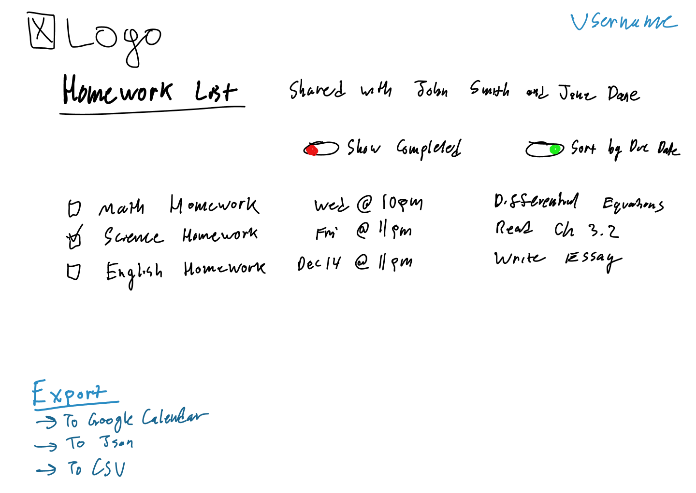

# Checkerly

## Hosted at [startup.n8petersen.link](https://startup.n8petersen.link).

--- 

## Design
This is a simple website that will enable a user to create check lists for any occasion, whether it be a to-do List, a shopping list, etc. Each list can be shared with other registered users on the website. The tasks can have a title, a due date/time, and a description. There will be multiple ways to sort the lists: Custom sort by dragging the tasks, Sort by Due Date/Time, Filter completed. 

---

### Key Features
- Ability to export the list in several different manners
- Secure login over HTTPS
- Tasks are stored in a server-side database
- Users can share lists with other users
- Users can see their lists as well as lists shared with them
- Can filter and sort by several parameters
- Can custom sort the lists

---

### What I've learned
- I've learned that during deploy, Caddy will sometimes have a file-lock on the file you are over-writing. To work around this, I added commands to my deploy script that will stop the Caddy service before the deploy, and restart it after.
- I've never used SVG before, so to get the 4 quarter-circles for the Simon game looking good took quite some time and effort.
- Vertically aligning elements in CSS is much harder than it probably needs to be, but using some `transform: translate` magic , it is possible.
- While Bootstrap makes it really easy to quickly customize a website and make it beautiful, there are only so many pre-determined things you can do to a website. Therefore a Bootstrap website looks very much like... well a Bootstrap website.
- While Bootstrap makes it easy to customize a website, it is easy to feel limited by its functionality. It is important to remember that Bootstrap should be used in addition to regular CSS, not as a replacement. It is intended to make repetitive tasks easier and quicker, but you can and still should customize things with regular ol' CSS.
- When utilizing Bootstrap, it is important to confirm your bootstrap version when consulting the documentation. I spent a long time frustrated that my page wasn't behaving the way the documentation was showing, but then I discovered I was on the page for an outdated Bootstrap version.
- I spent a long time getting my page to look nice on desktop, but when I tried the mobile version it looked horendous. I will have to work a little bit more to get it to look right on the mobile version. It is specifically the width of the body that is having issues, the rest is okay.
- Debugging in the browser DevTools is very useful when you can't figure out what is wrong with your program. My Simon wasn't working, but I saw there was an error with the reset() function, so I set a breakpoint on that function, and stepped through it until I saw an obvious issue: There was no addButton() function, which the reset() function calls. I had mispelled my function definition, so I fixed that and everything worked.
- JSON file format is awesome because JS has build in parsing functions for it to turn it into a JS object that you can use. I easily added a time to the scoreboard but adding that to the JSON object when it saved to local storage, and then added that to the part of scores.js that modifies the DOM.
- The tasks list was actually a bit more complicated than I thought it would be.
- Getting the form to format nicely with bootstrap while also still being functional with the javascript ended up also being a pain, so I gave up for a bit, but then revisited and got the text-forms looking how I wanted.
- A lot of the functionality is actually pretty database dependent, so I got the basic functionality of it working, but didn't want to waste too much time with code I'm going to have to totally re-write once the back-end is done, so I didn't do all of it.
- When implementing back-end javascript, very little has to change with the original front-end javascript. The original javascript can be served as static files, and you only have to change the parts that interact directly with the back-end (usually through some sort of API endpoint). In the case of simon, we only had to update the front-end JS that interacted with the updating and getting of scores, otherwise all the gameplay, and login, and so forth was the same. 
- Environment Variables proved to be more troublesome than I would have expected. I updated them in my /etc/environment file, which echoing them out in the terminal directly worked fine, but the node instance was getting the wrong ones until I forced them to update by running `pm2 restart all --update-env`, which works temporarily. If I restart the AWS EC2 instance, it reverts back to the old database connection, despite the environment variables sticking, and even indicating so when you run `echo $<ENV_VAR>`. Even when I check what node is getting by running `node -e "console.log(process.env.MONGOUSER)"` it returns the new variables I would expect.
- I added a line to database.js that just console.log's the url it's assembled, and at first it outputs the old, incorrect connection string. When I use `pm2 restart simon --update-env` and then check the log, it uses the new one. I have no clue where its getting the old values from, I've removed them from virtually every file I could think to.
- So it seems like when I restart the AWS EC2 instance, the simon service finds the old environment variables instead of the new ones? I have to run `pm2 restart simon --update-env` every time the EC2 instance restarts to get it to recognize the new ones.
- I figured it out. pm2 stores the old env variables in `~/.pm2/dump.pm2`, so when pm2 comes back up it grabs it from there.
- To fix this, after running `pm2 restart all --update-env`, if you run `pm2 save` it will save the current configuration (with the new env variables) to that dump.pm2 file, so it won't revert back to the old ones when the EC2 Instance/pm2 restarts.
- The authentication wasn't too bad to implement on Simon. I can do something very similar, if not the exact same on my startup.
- I learned that using dotenv might be preferable to using the actual environment variables. It's easier to copy them between environments, and it silos off the variables to that specific service. This way if you have several mongo databases, you don't have to create a bunch of environment variables on your system you have to maintain, but rather you set each service up to have their own variables, that other services don't interact with. 
